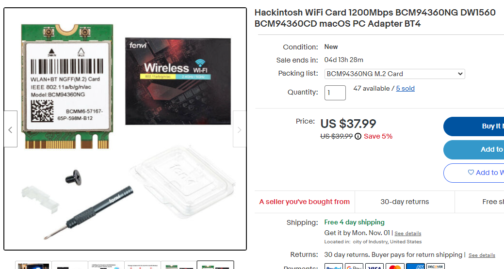
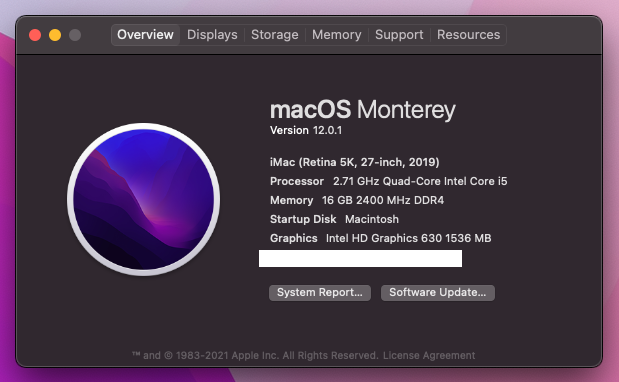
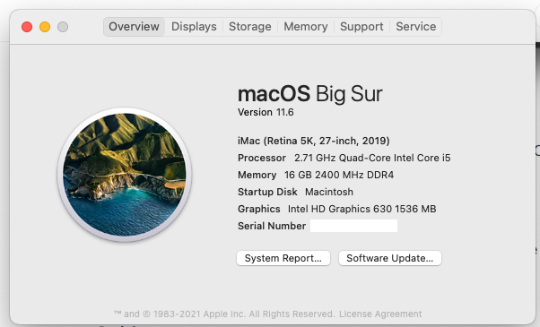
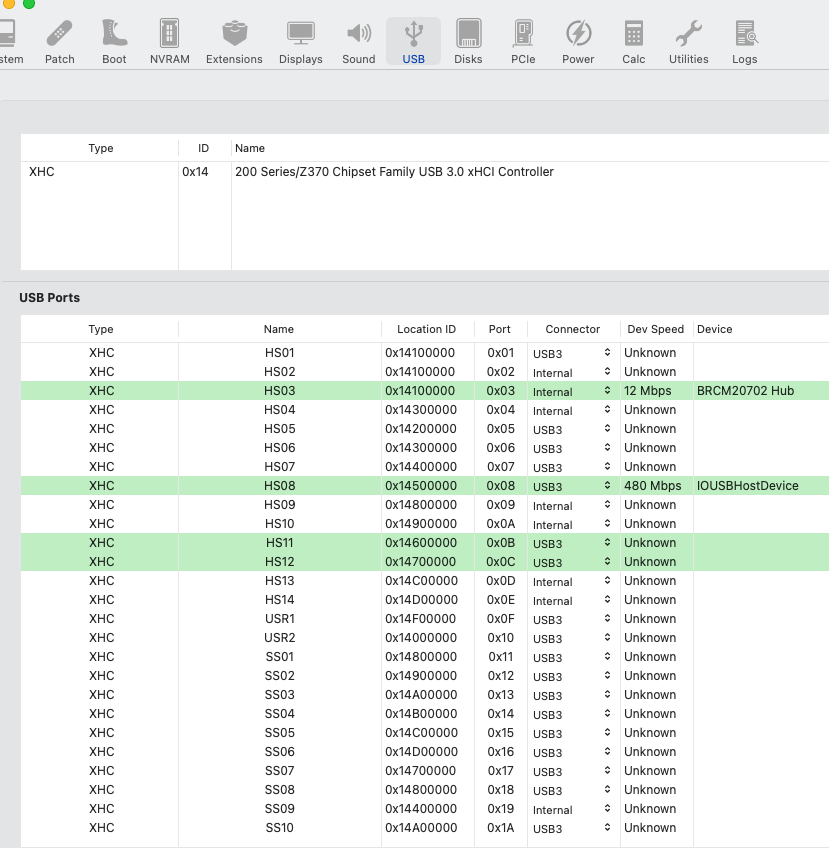
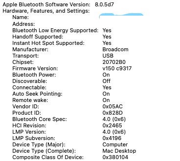
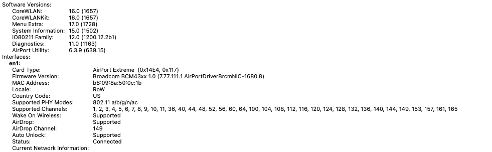

# Lenovo M910Q tiny Hackintosh
## Lenovo M910Q tiny 
This M910Q bought used with :
* Intel(R) Core(TM) i5-7500T CPU @ 2.70GHz , Kaby Lake platform
* HYNIX 8G DDR4
* SAMSUNG 250G SSD

Upgrading with:
* SK Hynix 8GB DDR4 1Rx8 PC4-2400T SO-DIMM MEMORY RAM MODULE HMA81GS6AFR8N-UH
* Hackintosh WiFi Card 1200Mbps BCM94360NG DW1560 BCM94360CD macOS PC Adapter BT4

## Hackintosh steps
### Opencore
* Install Python on Windows, Python is required for some Windows Tools.
* Download [Opencore](https://github.com/acidanthera/OpenCorePkg/releases), I am using release 0.7.4 here.
### Mac OS
* Mac OS big sur 11.6. I have update to MacOS 12.0.1 Monterey without any issue on 10/26/2021. 
*  
* Make a bootable USB disk follow [OpenCore Install Guide](https://dortania.github.io/OpenCore-Install-Guide/installer-guide/winblows-install.html)
### ACPI SSDT
M910Q only need one customized SSDT-PLUG.aml in ACPI directory, you may need to build your own .aml file for your computer in case your hardware is diffrent to mine even they all named M910Q. Tools:
* SSDTTime (Windows)
### config.plist
Follow [ OpenCore Install Guide for Desktop Kaby Lake ](https://dortania.github.io/OpenCore-Install-Guide/config.plist/kaby-lake.htmlhttp://google.com). make your own config.plist, the steps are not hard at all. 
Tools:
* ProperTree(Windows)
* tools for updating config.plist on USB disk, there is so many tools out there, I use DiskGenius(Windows)
### Drivers and Kexts
* Drivers
  * HfsPlus.efi
  * OpenCanopy.efi
  * OpenRuntime.efi

* Kexts
  * AppleALC.kext
  * Innie.kext
  * IntelMausi.kext
  * Lilu.kext
  * NVMeFix.kext
  * SMCProcessor.kext
  * SMCSuperIO.kext
  * USBToolBox.kext 
  * UTBMap.kext (for USB ports mapping, created in later step by USBToolBox)
  * VirtualSMC.kext
  * WhateverGreen.kext
  * XHCI-unsupported.kext
### BIOS
* Turn off securiy boot
* Set video RAM to 64MB
* USB
  * Turn on Legacy support
  * Turn on XHCI support( I forgot exact name, but should not matter)
### Hard disk partation and EFI transfer
I install dual boot on one SSD disk. This M910Q come with a Windows 10 Pro preinstalled on one partation assigned to C:, the partations looks like the table below, a recovery partation about 1G at the tail of the disk but I don't care:  

      EFI (200 M) | partation for c: (>200G)

use Windows disk manage tools to shrink C: partation, make room for two new partations:  new EFI and MacOS. Modified partations look like:

      EFI (200 M) | partation for c: (>100G) | EFI_new(200M) | MacOS (~70G)

Then use EFI recovery/transfer tool make a Windows EFI on EFI_new, delete EFI directory from old EFI partation , copy Opencore EFI directory to old EFI partation , the idea is to use Opencore EFI to replace Windows EFI so computer will boot Opencore EFI, Opencore EFI is able to find Windows EFI( stored in EFI_new) and boot it for you. this how dual boot works.  
There are many ways for doing dual boot, I just pick the dummy method. 
### Install Mac OS
The installation process may hung at some places, twick USB BIOS settings should solve the issue.  
After these steps, the M910Q has Windows and MacOS installed. 

### USB ports mapping
After a version of big sur, MacOS do not support more than 15 USB ports, so USB mapping is necessary if your motherboard has more than 15 USB ports. For M910Q, Bluetooth is not functioning because MacOS couldn't find the right USB ports associate with card.  
The good news Windows is very friendly for discovering hardware , Windows should has no problem to find and install driver for this card, you can use this Windows tool: [USBToolBox](https://github.com/USBToolBox/tool/releases) to create a USB ports mapping Kexts under Windows, then put them in Kexts directory. 

  * USBToolBox.kext
  * UTBMap.kext 

These two Kexts are only thing you need to install Wifi+Bluetooth card under M910Q MacOS. Bluetooth should work after a reboot. 

## Remaining issues
Sleep not working, it can not recovery after a long sleep, you have to hard reset the computer. 
